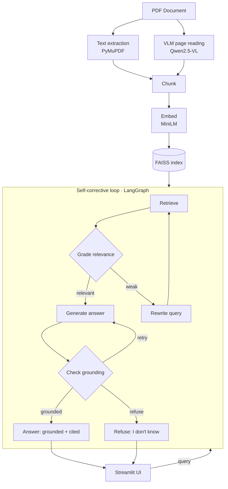

# Argus — Visual-Document Intelligence (Self-Corrective RAG)

> A local-first RAG system that **reads the tables, figures, and diagrams inside PDFs** — not just the text — then **checks its own answers and refuses when the evidence is thin.** Ships with a rigorous, cross-validated evaluation suite and a from-scratch fine-tuning pipeline (QLoRA + DPO).

Built and run entirely on consumer hardware (RTX 3070, 8GB) with a Windows + WSL2 workflow.

---

## Why this project is different

Most RAG demos read the *text* of a document and stop. They also answer *every* question, whether or not the evidence supports it. Argus does two things they usually can't:

1. **It sees.** A vision-language model reads the visual content — tables, figures, architecture diagrams — that plain text extraction mangles or misses entirely. When you ask *"what BLEU score did the Transformer big model achieve?"*, the answer comes from a table that lives inside an **image**.
2. **It doubts itself.** A LangGraph self-corrective loop grades its own retrieval, rewrites weak queries, checks whether the generated answer is actually grounded in the sources, and **refuses** ("I don't know based on the provided documents") rather than hallucinate.

Both capabilities are not just claimed — they're **measured**. See [Results](#results).

---

## Demo at a glance

The Streamlit UI has four tabs:

- **Ask Argus** — query the documents; answers show source badges distinguishing text (📄) from visual (📊 read from a figure/table) chunks.
- **Evaluation** — before/after comparisons proving the VLM layer and self-correction earn their place, plus hallucination rate and cross-validated retrieval metrics.
- **Fine-tuning** — QLoRA and DPO experiment results (before/after outputs, training/verification metrics).
- **Graph** — the compiled self-corrective LangGraph, rendered.

*(Test document used throughout: "Attention Is All You Need" — chosen because its key results live in tables and figures, the exact content text-only RAG fails on.)*

---

## Architecture



**Serving:** generation runs on **vLLM** (Docker, WSL2) via an OpenAI-compatible endpoint, replacing an earlier Ollama setup.

**The self-corrective loop** — every box is a LangGraph node; the decision points are the self-checks that make Argus skeptical of its own work:

- **Grade relevance** — are the retrieved chunks actually useful? If weak, rewrite the query and retry (bounded by a max-attempts cap).
- **Check grounding** — is the answer supported by the sources? If not, regenerate or refuse.

---

## Results

All numbers are from an independent judge (NVIDIA-hosted Llama-3.3-70B) against a 22-question gold set spanning text, visual, reasoning, and unanswerable categories. **Sample size is modest — results show clear direction, not precise percentages.**

### The VLM layer (headline differentiator)

| | Correct | Wrong |
|---|---|---|
| Text-only RAG (no VLM) | 15 / 22 | 6 |
| **Full Argus (with VLM)** | **18 / 22** | **2** |

Reading the visual content took correct answers from 15 -> 18 and cut wrong answers from 6 -> 2. Notably, the improvement spanned **text and reasoning** questions too, not just table lookups — because the VLM's page-level re-reading produces cleaner chunks across the board.

### The self-corrective loop

| | Correct | Wrong |
|---|---|---|
| Plain RAG | 17 / 22 | 2 |
| **Self-corrective** | **19 / 22** | **2** |

Self-correction improved correct answers 17 -> 19, primarily by resolving partial answers into complete ones — *after* the evaluation surfaced (and I fixed) a real calibration bug where an over-strict grader was rewriting good queries into nonsense.

### Serving: vLLM vs Ollama (same model, same prompts)

| | Single request | 16 concurrent (batch) |
|---|---|---|
| Ollama | 25.8 tok/s | 70.4 tok/s |
| **vLLM** | 31.7 tok/s | **496.2 tok/s** |

vLLM is comparable for a single request (~1.2x) but **~7x faster under concurrent load** — its PagedAttention batching shines when many requests arrive at once. (A separate Colab benchmark on a larger setup showed up to 19x batched vs sequential.)

### Retrieval quality (cross-validated)

| Metric | Self-built LLM-judge | RAGAS |
|---|---|---|
| Context precision | 0.48 | 0.58 |
| Context recall | 0.69 | 0.76-0.82 |

Two independent methods agree within ~0.1 — a genuine cross-validation. RAGAS's **faithfulness** metric was **excluded** after diagnosis: it scored on only 3-6 of 22 questions (its parser is sensitive to the judge model's output format), so it was unreliable. Faithfulness is instead covered by the grounding check and the hallucination rate.

### Hallucination rate

**16.7%** of unanswerable questions were answered instead of refused (both configs). The single shared failure was a *partially-grounded* question — relevant context existed but was misframed — a case grounding checks structurally cannot catch. An honest limitation, documented rather than hidden.

---

## Fine-tuning (QLoRA + DPO)

Fine-tuned Qwen-2.5-1.5B on an 8GB GPU (WSL2, `uv`, 4-bit QLoRA — 0.28% trainable params) to teach Argus's concise-cited answer style.

**QLoRA (3-iteration arc):** the first run overfit to noisy training data (dumping table fragments, hallucinating a URL) and produced *worse* output than the base model. Diagnosed as data-quality overfitting; rebuilt with clean, consistent examples; the final model reliably learned the target citation format. Key lesson: **fine-tuning amplifies data quality — clean examples matter more than more training.**

**DPO (preference tuning):** built a preference dataset (chosen vs. rejected pairs modeled on the *real* failure modes observed during the project). Training reached strong metrics (`rewards/accuracies = 1.0`). Verified the adapter genuinely applied via **weight- and logit-level diagnostics** (all 112 LoRA matrices non-zero; ~5.8 max logit shift vs. base) — even though greedy-decoded text was largely unchanged on the test prompts. Key lesson: **strong training metrics don't guarantee visible output change; verify at the weight/logit level, not just by eyeballing text.**

> Note: fine-tuning was an offline research exercise. The live app serves the base model via vLLM; the fine-tuned adapters are documented experiments, not the deployed model.

---

## Built With

**Core:** Python, PyTorch
**Document / vision:** PyMuPDF, Qwen2.5-VL (VLM, via Ollama)
**Retrieval:** sentence-transformers (all-MiniLM-L6-v2), FAISS
**Orchestration:** LangGraph, LangChain
**Serving:** vLLM, Ollama, Docker, WSL2
**Evaluation:** RAGAS, NVIDIA NIM (Llama-3.3-70B judge), custom LLM-as-judge, self-built precision/recall + hallucination metrics
**Fine-tuning:** QLoRA (peft + bitsandbytes), DPO (trl), transformers, accelerate, uv
**Frontend:** Streamlit
**Tooling:** Git, python-dotenv, pandas

---

## Engineering decisions (and things I deliberately *didn't* do)

Good engineering is as much about what you leave out as what you build. Some deliberate calls:

- **FAISS over a hosted vector DB (Pinecone).** For a single-document, single-user system, local FAISS is simpler and sufficient. Architected so it could be swapped for a cloud vector DB at scale.
- **DPO over RLHF/PPO.** DPO is the modern, stable replacement for the RLHF reward-model-plus-PPO pipeline; it delivers the same "align to preferences" outcome without the instability. Chose it consciously.
- **Self-corrective RAG over Graph RAG.** Both were on the table; self-correction was the higher-value differentiator for this use case.
- **No Supabase / no chat persistence.** Argus is single-turn (query -> grounded answer), so a database for conversation history would be solving a problem the app doesn't have. Left it out on purpose.
- **RAGAS faithfulness dropped**, not reported, once diagnosed as unreliable with this judge — reporting a metric computed on 3/22 questions would be misleading.

---

## Honest limitations

- **Small eval set (22 questions).** Results are directional, not statistically precise.
- **8GB VRAM constrains** the model sizes (1.5B-7B) throughout.
- **Table transcription is non-deterministic** run-to-run; the 7B VLM occasionally truncates a long table.
- **Retrieval precision (~0.5)** reflects some redundancy — the dual text+visual index can retrieve near-duplicate chunks of the same page. Deduplication is a clear improvement path.
- **Fine-tuned model is not wired into the live app** (documented as experiments).

---

## Roadmap / Future Work

- **FastAPI backend** to decouple serving from the Streamlit frontend.
- **Cloud vector DB (Pinecone / pgvector)** and a scaling path for millions of PDFs.
- **Multi-turn conversational RAG** with persistent chat history (a natural fit for Supabase, *when* the app needs it).
- **Wire the fine-tuned adapter into the live pipeline** and A/B it against the base model.
- **Graph RAG** as an alternate retrieval mode.
- **Live deployment** with a thinned server (hosted embeddings + generation) to fit a free tier.

---

## Running it locally

​```bash
# 1. Install dependencies
pip install -r requirements.txt

# 2. Add a PDF to data/pdfs/ and build the index (runs the VLM - slow, one-time)
python src/ingest.py

# 3. Start the vLLM server (Docker, WSL2) - serves the answer model
docker run --rm --gpus all -p 8000:8000 \
  -v ~/.cache/huggingface:/root/.cache/huggingface \
  vllm/vllm-openai:latest \
  --model Qwen/Qwen2.5-1.5B-Instruct --dtype half --gpu-memory-utilization 0.80

# 4. Launch the app
streamlit run src/app.py
​```

Evaluation and fine-tuning are in `eval/` and `finetuning/` respectively, each with its own notes. A `.env` file supplies `NVIDIA_API_KEY` for the evaluation judge.

---

*Built as a hands-on exploration of the full modern RAG + LLM stack — vision, agentic orchestration, serving, rigorous evaluation, and fine-tuning — with an emphasis on honest measurement over impressive-sounding claims.*
